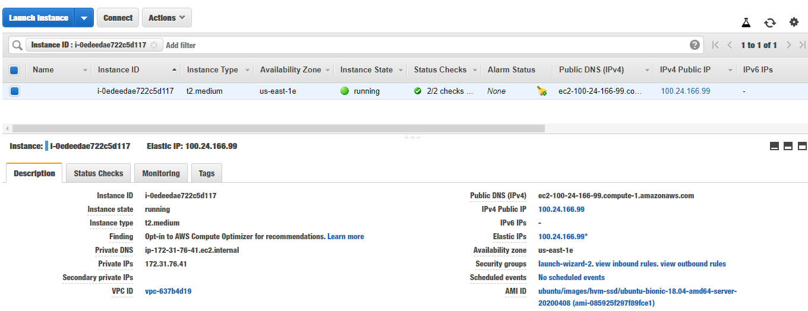
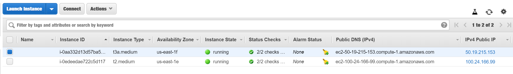

#### Máster Cloud Apps Módulo IV - DevOps, integración y despliegue continuo

# Práctica: Integración y Entrega Continua 

1. [Punto de partida y asunciones sobre el modelo de desarrollo del repositorio](#puntodepartida)
2. [Infraestructura](#infraestructura)
    * [Creación del proyecto y repositorio Github](#git)
    * [Jenkins en Instancia EC2 de AWS](#jenkins)
    * [Sonarqube en Instancia EC2 de AWS](#sonar)
    * [Configuración Jenkins <-> Sonarqube](#conexion)
    * [Configuración Webhook de Git](#webhook)
3. [Creación de un fichero Jenkinsfile](#3)
4. [Creación del Job para la generación una release Nightly](#4)
5. [Creación del Job para realizar un análisis estático del código con Sonarqube](#5)
6. [Ejemplo de funcionamiento completo](#funcionando)
    * [Creación de release 1.0.0](#release)
    * [Creación de release 1.1.0: añadiendo css a la web](#css)

---
<a name="puntodepartida"></a>
## **1. Punto de partida y asunciones sobre el modelo de desarrollo del repositorio** 

Partimos de una aplicación web con una base de datos MySQL, cada uno en un contenedor docker.

* El docker-compose para levantar ambos:

    ```yaml
    version: '3'
    services:
    web:
        build: .
        image: "mscarceller/practica-ci"
        container_name: "web"
        ports:
        - "8080:8080"
        links:
        - db
    db:
        image: mysql:5.7
        container_name: "db"
        restart: always
        command: --default-authentication-plugin=mysql_native_password
        environment:
        - MYSQL_ROOT_PASSWORD=pass
        - MYSQL_DATABASE=test
        ports:
        - '3306:3306'
        healthcheck:
            test: "/usr/bin/mysql --user=root --password=pass --execute \"SHOW DATABASES;\""
            interval: 3s
            timeout: 1s
            retries: 5
    ```

* El Dockerfile para construir la imagen de la aplicación web:

    ```
    FROM maven:3.6.3-jdk-8 as builder
    COPY . /project/
    WORKDIR /project
    RUN mvn -f pom.xml clean package -B -DskipTests=true

    FROM openjdk:8
    RUN apt-get update; apt-get install -y netcat
    COPY --from=builder /project/target/*.jar /project/
    COPY ./run.sh /project/
    WORKDIR /project
    RUN chmod 777 /project/run.sh
    EXPOSE 8080
    CMD ["/project/run.sh"]
    ```

* La metodologia para el control de versiones que se va a usar será TBD (Trunk Based Development):

  * Rama Master con una versión funcional de la aplicación.
  * Ramas cortas de features.
  * Ramas de release on tags de versiones.

    

El esquema general del sistema de integración continua que se va a implementar es el siguiente:


Con las siguientes consideraciones:

* Los desarrolladores, siguiendo metodologia TBD trabajan sobre master o sobre pequeñas ramas de features.
* Con cada commit o PR sobre la rama master o alguna rama de feature se ejecuta el pipeline de Jenkins con los test unitarios de la aplicación rest y se retorna la información con el resultado.
* Con cada cambio sobre master se publica una versión letest y se almacena en el repositorio de imagenes de dockerhub.
* Con cada commit en ramas de Release se ejecuta el pipeline, pero en este caso, ademas, se genera una imagen de la aplicación y se almacena en el repositorio de imagenes de dockerhub.
* De forma periódica se realizan:
  * Un analisis estático de código cuyo reporte se puede analizar mediante Sonarqube.
  * Una versión Nightly de la rama Master (al ser TBD se supone que debe tener siempre la última versión funcional de la aplicación)


<a name="infraestructura"></a>
## **2. Infraestructura** 

La infraestructura que se ha utilizado para la realización de la práctica es  es la siguiente:

* Repositorio de código en Github: 
    * URL: https://github.com/mscarceller/Practica-CI
* Jenkins intalado en una Instancia EC2 de AWS con una ElasticIP.
* Sonarqube instalado sonre una Instancia EC2 de AWs con eleasticIP.
* Repositorio de imagenes dockerhub: 
    * URL: https://hub.docker.com/repository/docker/mscarceller/practica-ci

El despliegue de cada elemento se explica en las siguientes secciones:

<a name="git"></a>
### **2.1 Creación del proyecto y repositorio Github**

Se inicia el repositorio y se sicroniza con el remoto:

    ```console
    git init
    git remote add origin git@github.com:mscarceller/m.sorianoc.2019-tbd.git
    ```

La metodologia que se seguirá será TBD (Trunk Based Development)

Para la primera release haremos los commits directamente a master:

* Añadimos el código fuente de la aplicación y hacemos el commit y push al repositorio remoto:

    ```console
    git add .
    git commit -m "First commit"
    git push origin master
    ```


<a name="jenkins"></a>
### **2.2 Configuración Jenkins**

* Crear una instancia EC2 en AWS:
* Asignar una IP Elástica, para poder referenciar la isntancia de Jenkins desde el webhook de git posteriormente.
* Instalar y configurar Docker y Docker Compose en la EC2.



* Instalar y configurar Jenkins.

En este punto ya podemos acceder a nuestro servidor de CI básico con Jenkins:


<a name="sonar"></a>
### **2.3 Configuración Sonarqube**

* Crear una instancia EC2 en AWS
* Asignar una IP Elástica, para poder referenciar la isntancia de Sonarqube desde Jenkins posteriormente.

    

* Instalar y configurar Sonarqube en la EC2, en este caso lo he hecho mediante una imagen docker:

    ```
    sudo docker run -d --name sonarqube -p 9000:9000 -p 9092:9092 sonarqube
    ```

En este punto ya podemos acceder a nuestro servidor de Sonarqube:


<a name="conexion"></a>
### **2.4 Conexión Jenkins-Sonarqube**

Para que jenkins y Sonarqube se puedan comunicar hay que configurar el plugin de Sonarqube scanner para Jenkins:


<a name="webhook"></a>
### **2.5 Configuración Webhook de Git**

* Enganchar jenkins y GitHub para buscar en el repo todos los jenkinsfiles configurando un webhook, para que, cuando se abre una PR, se ejecuten los test en jenkins y se reporte a github.


<a name="3"></a>
## **3. Creación de un fichero Jenkinsfile**

Este fichero será detectado por Jenkins y se ejecutará con cada PR que se haga en nuestro proyecto de gihub:
El fichero estara compuesto por diferentes secciones:

* Declaración de variables de entorno, que se usarán en diferentes puntos del script:

    ```
    environment {
        dockerImage = ""
        registry = "mscarceller/practica-ci"
        registryCredential = 'dockerhub_mscarceller'
        FULL_PATH_BRANCH = "${sh(script:'git name-rev --name-only HEAD', returnStdout: true)}" 
        GIT_BRANCH = FULL_PATH_BRANCH.substring(FULL_PATH_BRANCH.lastIndexOf('/') + 1, FULL_PATH_BRANCH.length()-1)
    }
    ```   

* Los diferentes pasos que contiene el proceso:

    ```
    stages {
        stage('Build image') {
            steps {
                script{
                    dockerImage = docker.build(env.registry)
                }
            }
        }
        stage("Start app") {
            steps {
                sh "docker-compose up -d"
            }
        }
        stage("UnitaryTests and RestTests"){
            steps { 
                sleep 20
                sh 'mvn test -Dtest="RestTest.java, UnitaryTest.java"'
            }
        }
        stage("e2e Selenium Tetst"){
            when { branch "release/*" }
            steps {
                script{
                    sh 'mvn test -Dtest="SeleniumTest.java"'
                    env.IS_RELEASE = "true"
                }
            }
        }
    }
    ```

* Las acciones que se ejecutarán una vez finalizado el proceso:
    * Las que se ejecutan siempre, independientemente del resultado:

    ```
        always {    
            sh "docker-compose logs > all-logs.txt"
            archiveArtifacts  "all-logs.txt"

            sh "docker-compose logs web > web-logs.txt"
            archiveArtifacts  "web-logs.txt"

            sh "docker-compose logs db > db-logs.txt"
            archiveArtifacts  "db-logs.txt"

            sh "docker-compose down"  
        }
    ```
    * Las que se ejecutan si no ha habido fallo, independientemente del resultado:
    ```
        success {
            script {
                script {
                if (env.IS_RELEASE){
                    docker.withRegistry( '', registryCredential ) {
                            dockerImage.push("${GIT_BRANCH}")
                    }
                    sh "docker rmi $registry:${GIT_BRANCH}"
                    
                    def subject = ""
                    def bodyText = ""
                    subject = "Release  ${GIT_BRANCH}  for Practica1-CI"
                    bodyText = """
                        Hi there!! 
                        
                        A new release has been published succesfully
                        
                        """
                    emailext body: bodyText, 
                    subject: subject,
                    to: "mscarceller@gmail.com"
                }
            }
            }
        }
    }
    ```

Jenkins ha detectado el repositorio que contiene el Jenkinsfile y ejecutamos el script para probar:


---

<a name="4"></a>
## **4. Creación del Job para la generación una release Nightly**

Creamos una nueva tarea en Jenkins:

* Configuramos la ejecución periódica (todas las noches a las 00:00)

    ```
    0 0 * * *
    ```

* Añadimos el script: descargará la ultima versión de la rama master del repo, que, al seguir una metodología TBD tendrá una version funcional, ejecuta los test, crea la imagen y la sube a dockerhub y además envia un correo informando de que se ha generado una Nightly release:

    ```
    pipeline {
        agent any
        environment {
            dockerImage = ""
            registry = "mscarceller/practica-ci"
            registryCredential = 'dockerhub_mscarceller'
        }
        stages {
            stage("Preparation") { 
                steps { 
                    git(url: 'https://github.com/mscarceller/Practica-CI.git', branch: "master",credentialsId: 'github_uspwd') 
                
                } 
            }
            stage('Build image') {
                steps {
                    script{
                        dockerImage = docker.build(env.registry)
                    }
                }
            }
            stage("Start app") {
                steps {
                    sh "docker-compose up -d"
                }
            }
            stage("Test") {
                steps { 
                    sleep 20
                    sh "mvn test"
                }
            }
        }

        post {
            always {
                sh "docker-compose logs > all-logs.txt"
                archive "all-logs.txt"

                sh "docker-compose logs web > web-logs.txt"
                archive "web-logs.txt"

                sh "docker-compose logs db > db-logs.txt"
                archive "db-logs.txt"

                sh "docker-compose down"
                junit "**/target/surefire-reports/TEST-*.xml"
            }
            success {
                        script {
                            docker.withRegistry( '', registryCredential ) {
                                dockerImage.push("nightly")
                            }
                            sh "docker rmi $registry:nightly"
                        }   
                        script {
                        def subject = ""
                        def bodyText = ""
                        subject = "Nightly Release for Practica1-CI"
                        bodyText = """
                            Hi there!!
                            
                            A new nightly release has been published succesfully
                            
                            """
                        
                        emailext body: bodyText, 
                        subject: subject,
                        to: "mscarceller@gmail.com"
                        }
                    }
        }
    }
    ```

* Imagen subida a Dockerhub:

    

* Correo recibido:

    


<a name="5"></a>
## **5. Creación del Job para realizar un análisis estático del código con Sonarqube**

Instalar y configurar el plugin de sonarqube scanner para Jenkins, como se explica en los anteriores apartados.

Creamos una nueva tarea en Jenkins con la siguiente configuración:

* Indicamoss el repositorio que se debe analizar:

    

* Configuramos la ejecución periódica (todas las noches a las 00:00)

    

* Indicamos el comando que se debe emplear, con algunos parámetros:

    


Cuando se realiza el analisis los resultados se ven del siguiente modo:

* En el resultado de la ejecución del job en Jenkins:

    

* En el resultado de la ejecución en el dashboard de Sonarqube:

    


<a name="funcionando"></a>
## **6. Ejemplo de funcionamiento completo**

A continuación mostramos los diferntes pasos de ejemplo. Se pretende sacar una primera release, con funcionalidad básica, y mas tarde, mediante la *feature1* añadir algo de estilo, mediante un fichero css a nuestra web:

Partiendo del código inicial del proyecto realizamos un primer commit sobre la rama master para añadir algo de información al README. Al tratarse de TBD, se lanza automáticamente el job de jenkins para analizar la rama y, en caso de que no haya ningun fallo en los test publicar una version *latest*


<a name="release"></a>
### **6.1 Creación de release 1.0.0**

En este punto vamos a sacar la release 1.0.0

 * Creamos la rama de relaese:

```console
git checkout -b release/1.0.0
```

 * Creamos el tag de la release:

```console
git tag "v1.0"
```

* Hacemos el push de la rama de release y de la tag:

```console
git push origin release/1.0
git push --tags
```

Se lanza automáticamente el job de Jenkins sobre la rama release:


Y si no hay ningun error (al tartarse de una rama de realese se ejecutan todos los test):


Se ha publicado en el repositorio de imagenes de dockerhub la versión de nuestra release:


Y se ha notificado por correo electrónico:


<a name="css"></a>
### **6.2 Creación de release 1.1.0: añadiendo css a la web**


En este momento comenzamos el desarrollo de la feature1, que consistirá en añadir una hoja de estilos que cambie el color de fondo de nuestra web (es un ejemplo, podria haber sido cualquier otra modificación). 

* Creamos la rama para la nueva feature:

```console
git checkout -b feature1
```

Se añade el nuevo fichero, ***style.css*** en la funcionalidad y se hace commit:

```console
git add .
git commit -m "Add style.css in feature1"
```

Se modifica el fichero ***style.css*** en la funcionalidad añadiendo algo de código para cambiar el color de fondo y se hace commit:

```console
git add .
git commit -m "Modify style.css: background color changed"
```

Se sube al repositorio remoto:

```console
git push -u origin feature1
```

Se resuleve la pull request haciendo **squash and merge** y borrando la rama:

* Vemos la pull request en el repositorio remoto:


* Abrimos la PR y aportamos la información sobre los cambios para el resto del equipo:


* Se crea la PR y vemos como comienza la validación en Jenkins:


* Si todo ha ido OK:


* Se resuleve la pull request haciendo **squash and merge**:


* Finalmente eliminamos la rama:


Actualizamos nuestra rama master:

```console
git checkout master
git pull --rebase origin master
```

En este punto vamos a sacar la release 1.1.0

* Creamos la rama de relaese:

```console
git checkout -b release/1.1.0
```

* Creamos el tag de la release:
```console
git tag "v1.1.0"
```

* Hacemos el push de la rama de release y de la tag:

```console
git push origin release/1.1.0
git push --tags
```

Se lanza automáticamente el job de Jenkins sobre la rama release, como en el caso anterior, y si no hay ningun error (al tartarse de una rama de realese se ejecutan todos los test):


Se ha publicado en el repositorio de imagenes de dockerhub la versión de nuestra release:


Y se ha notificado por correo electrónico:


---

FINALMENTE HACEMOS UN COMMIT A MASTER CON EL README ACTUALIZADO